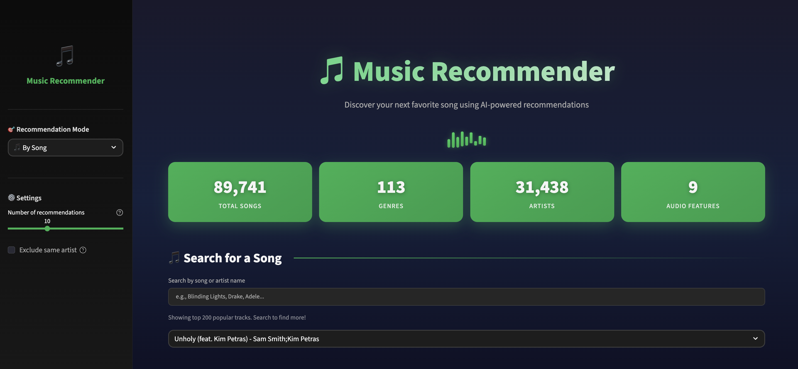

# 🎵 Spotify Music Recommendation System

A content based music recommendation system with a Spotify inspired design. Uses machine learning to recommend songs based on audio features like danceability, energy, valence, tempo, and more.

---

## Live Website

**[https://SpotifyMusicReccomendationSystem.com](https://spotify-music-recommendation-system-8uq2.onrender.com/)**

---

## App Preview



---

## Features

- **Song based recommendations** using cosine similarity on audio features
- **Mood based recommendations** for Happy, Sad, Energetic, Chill, Party, and Focus moods
- **Custom feature sliders** to fine tune recommendations by audio characteristics
- **Search and browse** across 89,000+ tracks and 113 genres
- **Interactive visualizations** with radar charts and feature comparisons
- **Spotify themed UI** with smooth animations and professional design

---

## Audio Features Used

| Feature | Description | Range |
|---------|-------------|-------|
| Danceability | How suitable for dancing | 0.0 - 1.0 |
| Energy | Intensity and activity measure | 0.0 - 1.0 |
| Valence | Musical positiveness/mood | 0.0 - 1.0 |
| Tempo | Beats per minute | 60 - 200 |
| Acousticness | Acoustic vs electronic sound | 0.0 - 1.0 |
| Instrumentalness | Vocal presence prediction | 0.0 - 1.0 |
| Speechiness | Presence of spoken words | 0.0 - 1.0 |
| Liveness | Audience presence detection | 0.0 - 1.0 |
| Loudness | Overall volume in dB | -60 - 0 |

---

## How It Works

1. **Feature Extraction** – Each song has 9 audio features from Spotify's audio analysis
2. **Normalization** – Features are scaled using MinMaxScaler (0-1 range)
3. **Similarity Computation** – Cosine similarity measures the angle between feature vectors
4. **Ranking** – Songs are ranked by similarity score to generate recommendations

---

## Technologies Used

- **Python 3.11**
- **Streamlit** for the web application
- **pandas** for data manipulation
- **scikit-learn** for ML (MinMaxScaler, cosine_similarity)
- **NumPy** for numerical operations
- **Plotly** for interactive visualizations

---

## How to Run Locally

Clone the repo:
```bash
git clone https://github.com/SammyBolger/spotify-music-recommendation-system.git
cd spotify-music-recommendation-system
```

Install dependencies:
```bash
pip install -r requirements.txt
```

Run the application:
```bash
streamlit run app.py
```

---

## Dataset
[Spotify Tracks Dataset](https://www.kaggle.com/datasets/maharshipandya/-spotify-tracks-dataset) containing 114,000+ tracks with audio features across 113 genres.

---

## Future Work

- **Add collaborative filtering** using user listening history
- **Implement playlist generation** based on mood transitions
- **Add artist similarity** recommendations
- **Explore integration** with Spotify API for real time data

---

## Contact

- **LinkedIn:** [Sam Bolger](https://www.linkedin.com/in/sambolger/)
- **Email:** sbolger@cord.edu
- **Portfolio:** [sammybolger.com](http://www.sammybolger.com/)
